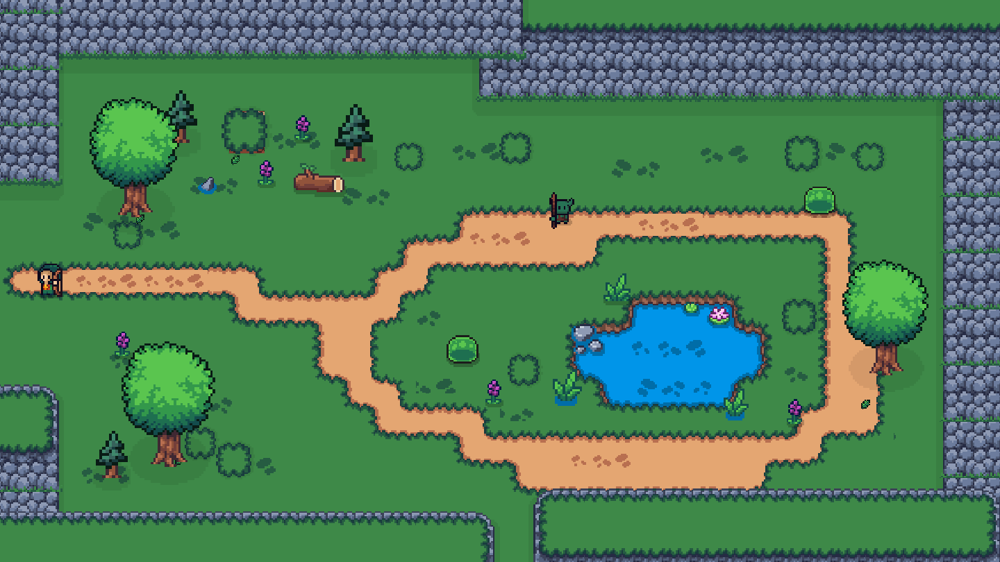

# Session 07 Handoff - Reedwater Hollow and BoomShroom Fix

**Date:** 2026-09-15 (America/Denver)
**Owner:** Codex on `Codex`
**Checkout:** `D:\Zelda`; `C:\Zelda` is the junction used by the connected Editor
**Base revision:** `bdb4087` (`Restore Game scene and document room build`)
**Status:** Z-012 implemented and verified; Z-010 repaired in the follow-up below. Changes are local, uncommitted, and not pushed.

## Resume in the next session

- Read [AGENTS.md](../../AGENTS.md), [Start-Here](../Start-Here.md), [Codex](../Codex.md), [About-Me](../About-Me.md), and [Tracked Items](../Tracked-Items.md). Verify the checkout and `Codex` branch before writes.
- Preserve this session's uncommitted scene, map, importer, prefab, documentation, and screenshot changes. The session began clean at `bdb4087`; these changes belong to the completed work below. Nothing is staged, committed, or pushed. `Codex` tracks `origin/Codex`, but remote freshness was not checked during this documentation-only close-out.
- **Current Unity state, verified at close-out:** Play mode stopped, Editor ready, compilation complete, `Assets/Scenes/Game.unity` clean, 28 scene roots, `Room_2_0` present, camera `(0,0,-10)`, and no selected GameObject. Live Console has 0 errors and 0 warnings. The MCP buffer retains historical entries; use live ground truth or a fresh cursor when checking recurrence.
- **Completed:** Z-012 Reedwater Hollow, Z-005 adjacent-room workflow, and Z-010 BoomShroom explosion reference. Reach the room by traveling east twice from Room_0_0. Its concealed northwest bush leads to the existing cave.
- **Next assignment:** None yet. Zerenn played and reported the BoomShroom warning, which was fixed; explicit approval of room appearance/feel has not been recorded. No independent auditor ran. Open tracker scopes are Z-001 through Z-004, Z-006 through Z-008, and Z-011; do not select unrelated work automatically.
- This is a same-checkout new-session handoff. A different computer will not receive these uncommitted files through Git. If a computer transfer is requested, follow [Workflow](../Workflow.md#switch-computers-or-start-a-new-chat).

Suggested opening prompt for the next session:

```text
Read AGENTS.md, Docs/Start-Here.md, Docs/Sessions/Session-07-Handoff.md, and Docs/Tracked-Items.md. Verify the checkout and Codex branch. Preserve the uncommitted Reedwater Hollow room and BoomShroom prefab fix. Use the handoff for context; I will provide the next task.
```

## Finished room

`Assets/Scenes/Game.unity` now contains **Room_2_0 - Reedwater Hollow**, centered at `(36,0)` with the established 18 x 10 footprint. From the starting room, take the east exit twice: `Room_0_0 -> Room_1_0 -> Room_2_0`.

- A west entry clearing opens onto a winding path around an irregular pond.
- Tiled stone cliffs, stepped shelves, trees, cuttable grass, flowers, fallen wood, reeds, lilies, and water ripples compose the room.
- Two existing Slimes and one GoblinSpearman form a modest encounter beyond the entry. Their instance `wanderSpeed` is zero; their normal chase and attack behavior activates when approached. Enemy scripts and prefabs were not changed.
- A bush in the northwest grove conceals the cave entrance. An Archer can clear it with an arrow; the existing Destructible component also supports melee. It follows normal cuttable-vegetation lifetime, with no new persistence system.
- `WorldMap.asset` registers `(2,0)` as an ordinary overworld room. The existing room tracker and minimap include it.



## Original secret content and reuse

Preflight inspected `Room_0_0`, adjacent rooms, the original secret components, and both interiors before scene changes.

- `Room_0_0/Cracked` still references the disabled `Cave_Doorway_1_0` at `(-4,5)`. The entrance was hidden behind the cracked-wall implementation; the destination was not deleted.
- `Room_Secret_0_2` exists at world `(-3600,0)`, registered as special room `(-200,0)`. It is the angel/fountain cave.
- The shop is a different root, `BuildingInterior1`, containing `Miner_Mike_0`.
- The new bush entrance reuses the original cave. Arrival is cave-local `(5,-3.1)`; the added `Return_To_Reedwater_Hollow` exit at cave-local `(5,-4.25)` returns to new-room-local `(-4.5,1.65)`.
- The original cracked-wall entrance and the cave's original return to `(0,0)` remain unchanged. No duplicate secret room was created.

The original cave's decoration was retained. [Cave arrival and the added return exit](../Recon/Images/Z012-Cave-Return.png).

## Changes and construction

Gameplay assets changed for the room build:

- `Assets/Scenes/Game.unity`
- `Assets/Data/WorldMap.asset`
- `Assets/Sprites/Tiles/Stone_Cliff_1_Tile.png.meta`
- `Assets/Sprites/Tiles/Water_Tile_1.png.meta`
- `Assets/Sprites/Prefabs/PrefabTiles/Grass_Tiles_1.png.meta`
- `Assets/Sprites/Prefabs/PrefabTiles/Grass_1_Middle.png.meta`

The existing atlases lacked separate usable path/water edges and a repeatable cliff slice. Added 28 sprite slices in total, retaining existing sprite names/IDs and 16 PPU. The room build changed no PNG art, gameplay C#, or prefab assets; the subsequent BoomShroom fix changes one prefab as described below. Full Rect meshes support tiled grass/cliffs. Unity normalized importer metadata, including center-pivot serialization and default platform settings.

Cliffs use `SpriteRenderer` Tiled mode with preserved borders and equal X/Y scale. Their center texture repeats to make length. Path and water use edge/corner slices on a half-unit grid, with a uniform 0.02% overlap to prevent atlas sampling lines at fractional screen pixels. A native SpriteMask confines the new room's rendering to 18 x 10; perimeter collision is clipped to the same footprint. The startup camera remains `(0,0,-10)` with orthographic size 5.

Scene object-block comparison preserved every one of the 1,015 original serialized objects. Only three original blocks changed: the adjacent transition parent's child list, the cave root's child list, and the scene root list. Much of the large textual scene diff is Unity's object ordering, not replacement of existing content.

## Verification

- Reopened the saved Game scene and rechecked actual components, collision, references, and map registration.
- Foot-collider scan: 1,472 connected walkable samples, zero isolated clear samples, zero closed-edge gaps, zero missing scripts in the new room. All path checkpoints and enemy starts are clear.
- **23 traversal checks passed** using virtual New Input System devices through the existing InputManager, PlayerController, and Archer arrow behavior: west entry, full pond loop, water and all four cliff sides, normal exit/re-entry, solid uncut bush, arrow clearing, cave arrival, correct return, and no immediate retrigger.
- Repeated cave entry/return passed separately.
- **4 combat checks passed:** slime chase and arrow defeat; spearman telegraph/charge and arrow defeat; player remains alive and controllable.
- Live RoomTracker visited status and MinimapUI cell for `(2,0)` were confirmed.
- Final live Console check: zero errors, zero warnings; compilation finished. Authoring/test scripts compiled through Pipeline. No project-authored Unity test assemblies were found; package tests were not treated as room tests.
- Camera captures inspected at 16:9 and at an integer pixel scale. The second pass corrected path corners, shoreline detail, a pebble patch outside its path, tile sampling seams, and footprint spillover.
- Original save/inventory/visited preferences were restored and compared with the pre-test snapshot. Test input devices, binding overrides, and temporary input settings were restored. Play-mode mutations were not saved.

Earlier harness attempts sampled Rigidbody position before teleport synchronization and let the physical mouse win aim binding resolution. These were corrected; the final traversal and combat reports pass. This is a Codex self-review and automated Play-mode check, not an independent audit or Zerenn's subjective feel review.

`git diff --check` flags Unity-generated trailing spaces on empty YAML values. Documentation checks and the diff check excluding end-of-line blank warnings pass. Serialized files were left as saved by Unity, following the editor-only write workflow.

Temporary builder, inspection, and Play-mode test files are in `Temp/Z012-Authoring`. Temp does not transfer through Git and may be cleared. Durable evidence is [Z012 verification](../Recon/Z012-Reedwater-Hollow-Verification.md) and the images linked above.

## Authorization and editor state at room delivery

Zerenn explicitly approved Pipeline `eval`/`run_script` for this room build and verification after `Unity_RunCommand` was confirmed unavailable. This is the task-specific Z-004 exception; the general AGENTS.md rule was not rewritten. No `Unity_ManageGameObject` calls or full Unity-object serialization were used.

At room delivery, Unity was stopped with the saved Game scene clean and `Room_2_0` selected and framed in Scene view. The normal startup camera and player placement were preserved. Play from the starting room and travel east twice to reach the result. The current close-out state is recorded at the top of this handoff.

At room delivery, Z-012 and the adjacent-room workflow Z-005 were complete. Z-010 was subsequently fixed below. Z-001 through Z-004 and Z-011 retain their separate scopes. No commit, push, merge, or independent audit was requested or performed.

## Follow-up - BoomShroom explosion warning (Z-010)

Zerenn reported the missing-Behaviour warning from `BoomShroom.Explode()` while playing. Traced the assigned effect to `Assets/Sprites/Prefabs/PrefabIcons/ToxicExplosion.prefab`. Its `ExplosionEffect` component had stale script GUID `7a924de975f71284e9aaa08f86c924ce`; no asset resolves that GUID. The existing script and working BombExplosion prefab use `f03f28458b68097adb7490a61dee0d30`.

Rebound `m_Script` using Unity's SerializedObject API and saved with PrefabUtility. The small prefab diff changes that reference and serializes the current radius/damage defaults (2/2). Component ID, lifetime 0.5, sprite, Animator, and other authored values remain intact. BoomShroom continues forwarding its own radius/damage, including its normal damage of 1. No gameplay source or saved scene changes were made in this follow-up.

Validation in the existing Play session, using isolated temporary objects at `(9000,9000)`:

- Direct `Explode()` twice in one frame: one effect and one hit, confirming the existing duplicate guard.
- `TakeDamage()` detonation with radius 0.75 and damage 3: overrides forwarded correctly.
- Existing `BlinkThenExplode` coroutine: delayed detonation creates the valid effect.
- Every case damaged the in-range target once, left an out-of-range target untouched, destroyed the mushroom, and cleaned up the effect after its lifetime.
- Asset reimport: zero missing scripts and correct MonoScript reference. Console cursor check: no new warnings/errors. The eight historical missing-script warnings remain in the user's console; it was not cleared.

The temporary test helper is `Temp/Z012-Authoring/VerifyBoomShroom.cs`. An initial harness compile attempt used the wrong editor callback delegate, and the first runtime attempt timed out because the unfocused Editor was not advancing game frames. Corrected the delegate and temporarily enabled background updates; the final complete run passed. These attempts were harness issues, not evidence of additional gameplay defects.

**State at fix delivery:** The user's existing Play session was left running, the Game scene was clean, no test objects remained, and the prior `runInBackground=false` setting was restored. Gameplay preferences and input bindings were not edited. Zerenn subsequently stopped Play mode; close-out confirmed the stopped, clean state and zero current Console warnings/errors. Z-010 is complete; all changes remain local and uncommitted.

## Documentation and delivery inventory

In addition to the six room assets listed above and `Assets/Sprites/Prefabs/PrefabIcons/ToxicExplosion.prefab`, this session updates:

- `Docs/Start-Here.md` - current handoff pointer.
- `Docs/Tracked-Items.md` - completion evidence and remaining scopes.
- `Docs/Unity-MCP-Rules.md` - bounded room-build authorization.
- `Docs/Zerenn-Decisions.md` - room composition and secret reuse decisions.
- `Docs/Zerenn-Bug-History.md` - Z-010 cause, fix, and verification.
- `Docs/Error-Log.md` - authoring and test-harness lessons.

New files to include in a future requested commit:

- `Docs/Sessions/Session-07-Handoff.md`
- `Docs/Recon/Z012-Reedwater-Hollow-Verification.md`
- `Docs/Recon/Images/Z012-Reedwater-Hollow.png`
- `Docs/Recon/Images/Z012-Cave-Return.png`

The final handoff pass changes documentation only. Relative links and documentation whitespace were checked. No extra gameplay work, tests, commit, push, merge, or computer synchronization was performed for the handoff request. Temporary C# helpers under `Temp/Z012-Authoring` are local verification aids, not tracked deliverables.
